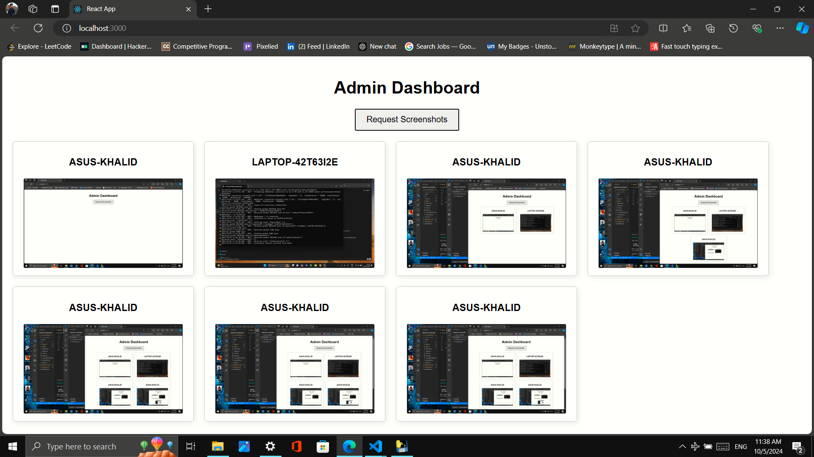

# PC Monitoring System

PC Monitoring System allows an admin to monitor multiple systems connected to the same LAN. The admin can request screenshots from each connected device, and the screenshots will be sent to the admin dashboard for viewing.

## Project Structure

The project is divided into three main parts:
1. **Frontend** (React): The admin dashboard where all screenshots are listed.
2. **Backend** (Node.js): Handles screenshot requests and forwards them to connected clients.
3. **Client** (Python): Installed on each client device. It captures screenshots upon request and sends them back to the server.

## Folder Structure

```
PC-Monitoring-System/
├── backend/         # Node.js backend for handling requests
├── frontend/        # React frontend (Admin dashboard)
└── client/          # Python client app (client.exe)
```

## Setup Instructions

### Backend Setup (Node.js)

1. Navigate to the backend folder:
   ```bash
   cd backend
   ```
2. Install dependencies:
   ```bash
   npm install
   ```
3. Start the backend server:
   ```bash
   node index.js
   ```

### Frontend Setup (React)

1. Navigate to the frontend folder:
   ```bash
   cd frontend
   ```
2. Install dependencies:
   ```bash
   npm install
   ```
3. Start the frontend server:
   ```bash
   npm start
   ```

### Client Setup (Python)

1. Navigate to the client folder:
   ```bash
   cd client
   ```
2. Install dependencies:
   ```bash
   pip install -r requirements.txt
   ```
3. Create the client executable:
   ```bash
   pyinstaller --onefile client.py
   ```
4. Install the generated `client.exe` on each client device.

## How It Works

- The **admin** logs into the React dashboard and requests screenshots from all connected devices.
- The **Node.js backend** sends the screenshot request to all connected clients.
- The **Python client** installed on each device captures the screenshot, sends it back to the backend, which is then forwarded to the frontend for display.

## Screenshots
Here is a preview of the admin dashboard where all screenshots are listed:

  # Update with actual path

---

## How to Contribute

Feel free to fork this repository and make improvements or fixes. Any contributions are welcome!
